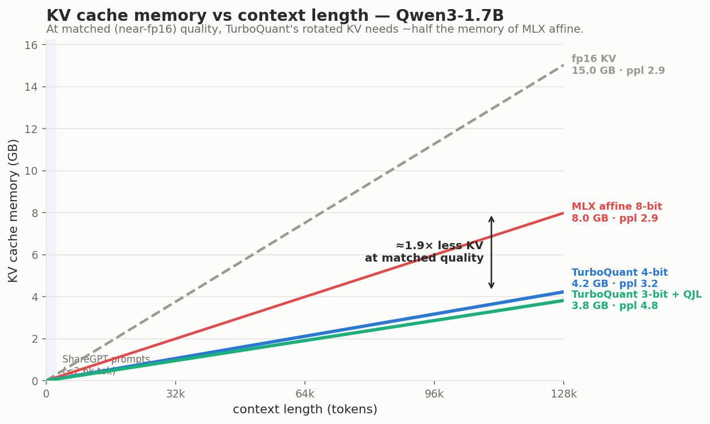

# mlx-turboquant

A standalone, pip-installable **TurboQuant** adapter for
[mlx-lm](https://github.com/ml-explore/mlx-lm) on Apple silicon, with a custom
Metal kernel for non-uniform quantization.

TurboQuant ([Zandieh, Daliri, Hadian, Mirrokni, 2025](https://arxiv.org/pdf/2504.19874))
is a *data-oblivious* (calibration-free) vector quantizer. Its core trick is a
**random rotation** (a Randomized Hadamard Transform): rotating a vector spreads
outliers across coordinates and turns the marginal into a concentrated,
near-Gaussian distribution that low-bit scalar quantizers handle gracefully.
Crucially, an orthogonal rotation **preserves inner products**, so attention
scores computed on rotated queries and keys are unchanged — which is what makes
it so effective for KV-cache quantization.

This adapter implements both regimes:

- **Weights (MSE regime).** Rotate each weight matrix, then quantize. Rotation
  is the robust, always-on win; you can quantize with MLX's fast affine
  `quantized_matmul` (default) or with a custom **non-uniform Lloyd–Max LUT
  Metal kernel** (`--mode lut`).
- **KV cache (inner-product regime).** A drop-in `TurboQuantKVCache` that stores
  keys in the rotated frame and rotates the query to match. This is where
  TurboQuant shines (see numbers below).

## Install

```sh
pip install mlx-turboquant        # from PyPI
# or, from source:
pip install -e .
```

Requires `mlx>=0.31.2` and `mlx-lm` on macOS/Apple silicon.

## Quantize a model (weights)

```sh
turboquant convert --model mlx-community/Qwen3-0.6B-bf16 --out ./qwen3-tq4 --bits 4
```

Produces a standard mlx-lm model directory (safetensors + `config.json` with a
`quantization_config` of `quant_method: turboquant`).

## Run

```python
import mlx_turboquant as tq
tq.register()                       # teach stock mlx-lm to load turboquant dirs
from mlx_lm import load, generate
model, tok = load("./qwen3-tq4")
print(generate(model, tok, prompt="Why is the sky blue?", max_tokens=128, verbose=True))
```

or the CLI:

```sh
turboquant generate --model ./qwen3-tq4 --prompt "Why is the sky blue?"
```

## Quantize the KV cache (long-context inference)

The KV cache is applied at generation time to any (even unquantized) model:

```python
import mlx_turboquant as tq
from mlx_lm import load, generate
model, tok = load("mlx-community/Qwen3-1.7B-bf16")
cache = tq.make_prompt_cache(model, kv_bits=4, kv_group_size=64)   # rotated KV
# or, for the unbiased 1-bit QJL residual estimator (+1 bit/channel):
cache = tq.make_prompt_cache(model, kv_bits=3, kv_group_size=64, qjl=True)
generate(model, tok, prompt=..., max_tokens=256, prompt_cache=cache, verbose=True)
```

### The 1-bit QJL residual (unbiased inner-product estimator)

The rotated-MSE key `k̂` gives a *biased* attention score:
`<Rq, k̂> = <Rq, Rk> − <Rq, r>` (it under-counts by the residual inner product
`<Rq, r>`), and the bias is **largest for the high-similarity keys softmax
weights most**. TurboQuant fixes this with a 1-bit **QJL** sketch of the residual
`r = Rk − k̂`: store `sign(RHT₂(r))` (1 bit/channel) and `‖r‖`, then estimate
`<Rq, r> ≈ √(π/2d)·‖r‖·⟨RHT₂(Rq), sign(RHT₂(r))⟩`. Adding it back yields an
**unbiased** score. Verified numerically ([tests/test_qjl.py](tests/test_qjl.py)):
for correlated (query, key) pairs the MSE-only bias of ≈ −0.05 is removed to
≈ 0. Enable with `qjl=True`.

## Measured results (`benchmarks/kv_quality.py`, 509-token context)

Teacher-forced perplexity with a quantized KV cache (lower is better):

**Qwen3-1.7B** (fp16 reference = 2.93):

| KV bits | plain affine KV | **TurboQuant KV** | **TurboQuant + QJL** (+1 b/ch) |
|--------:|----------------:|------------------:|-------------------------------:|
| 8       |    2.91         |     2.93          |          2.91                  |
| 4       |   31.39 💥      |   **3.16**        |        **3.03** ✅             |
| 3       |    4625         |    77.5           |        **4.82**                |
| 2       |   2.1e6         |    28704          |        6937                    |

**Two effects, both the paper's claims, reproduced:**
1. **Rotation** — at 4-bit, plain affine KV collapses (ppl ~31) while TurboQuant's
   rotated KV stays near-neutral (3.16). Rotation preserves inner products and
   removes the outliers that wreck low-bit affine KV.
2. **QJL residual** — the +1-bit unbiased correction closes the last gap: 4-bit KV
   becomes fp16-neutral (2.93), and it rescues 3-bit KV from unusable (77.5) to
   usable (5.55). This matches the paper's "quality-neutral at ~3.5 bits/channel".

(2-bit weight-*only* and ≤3-bit KV without QJL break these small models; the
larger the model, the lower the bits you can push.)

## Throughput, latency & memory (`benchmarks/throughput.py`, Qwen3-1.7B)

Median over **50 ShareGPT prompts** of varied length (13–2631 tokens, median
224), 64 decode tokens each, on Apple silicon. `prepare_sharegpt.py` samples the
prompts; `throughput.py` runs the grid.

| config | decode tok/s | TPOT (ms) | TTFT (ms) | weights | KV @ 2k ctx |
|---|--:|--:|--:|--:|--:|
| MLX LM bf16 (baseline)        | 26.6 | 37.6 | 327 | 3.44 GB | 0.23 GB |
| **TurboQuant 4-bit + KV4**    | **56.6** | **17.7** | 330 | **1.42 GB** | **0.066 GB** |
| TurboQuant 4-bit + KV4 + QJL  | 27.6 | 36.3 | 543 | 1.42 GB | 0.074 GB |

**Recommended config — TurboQuant 4-bit weights + rotated 4-bit KV:**

- **~2.1× faster decode** than bf16 (56.6 vs 26.6 tok/s) and **~2.1× lower
  time-per-token** (17.7 vs 37.6 ms) — memory-bound decode loves 4-bit weights,
  and the rotated KV cache adds essentially no overhead.
- **2.4× smaller weights** (3.44 → 1.42 GB) and **~3.5× smaller KV cache**
  (0.23 → 0.066 GB at 2k context) — so you fit far longer contexts in the same
  memory, the real constraint for on-device long-context inference.
- All while staying **near fp16 quality** at 4-bit KV where plain affine KV
  collapses (see above).

**QJL mode** (`qjl=True`) is the *maximum-quality / maximum-compression* option:
it makes 3-bit KV usable and 4-bit KV fp16-neutral for only +1 bit/channel
(0.066 → 0.074 GB). It trades decode speed for that quality (the unbiased
correction adds an extra sketch dot-product per step), so reach for it when you
are memory-bound at very low KV bits and want fp16-grade scores.

### Memory footprint over long context

The KV cache — not the weights — is what grows with context and dominates memory
for long sequences. Since MLX's affine KV is unusable at 4-bit (ppl ~31), the
honest comparison is **iso-quality**: to stay near fp16, affine needs **8-bit**
KV while TurboQuant is neutral at **4-bit**, so TurboQuant's KV cache is **~1.9×
smaller at matched quality** (and 3.5× smaller than fp16).



Measured on Qwen3-1.7B (`benchmarks/kv_memory.py` → `plot_kv_memory.py`); the
ShareGPT prompt range is shaded, extrapolated to long context:

| KV config | quality (ppl) | KB/token | KV @ 32k | KV @ 128k |
|---|--:|--:|--:|--:|
| fp16                        | 2.93   | 112.0 | 3.76 GB | 15.0 GB |
| MLX affine 8-bit            | 2.91   |  59.5 | 2.00 GB |  8.0 GB |
| MLX affine 4-bit            | 31.4 ✗ |  31.5 | 1.06 GB |  4.2 GB |
| **TurboQuant 4-bit**        | **3.16** | 31.5 | **1.06 GB** | **4.2 GB** |
| **TurboQuant 3-bit + QJL**  | **4.82** | 28.4 | 0.95 GB |  3.8 GB |

TurboQuant 4-bit uses the *same* bytes as affine 4-bit but is actually usable
(3.16 vs 31.4). At 128k context that's a **4.2 GB KV cache instead of 8 GB
(affine, matched quality) or 15 GB (fp16)** — often the difference between
fitting long context on-device or not.

## The Metal kernels

TurboQuant needs two operations MLX can't express with built-ins, so the adapter
ships two hand-written `mx.fast.metal_kernel`s:

1. **Non-uniform LUT dequant + matmul** (`kernels/qmm.py`). `mx.quantized_matmul`
   only supports uniform/affine codebooks; TurboQuant's MSE-optimal quantizer
   uses a **non-uniform Lloyd–Max codebook**. The kernel does LUT dequant + matmul
   directly on packed indices (one SIMD group reduces over `K` per output),
   `bits ∈ {2,4,8}`, and cuts weight-reconstruction MSE ~15% vs affine at 2-bit.
   Enable with `--mode lut`.
2. **Packed-sign QJL inner product** (`kernels/qjl_dot.py`). The unbiased KV
   correction computes `Σ_d qproj[d]·sign_bit(d)` against the 1-bit residual
   sketch. The kernel reads the packed `uint32` sign words directly and
   accumulates `±qproj` per bit in fp32 — no dense unpack, no extra full matmul —
   powering the QJL KV path.

Rotations run on Metal via `mx.hadamard_transform`.

## How it plugs in

- **Weights:** `nn.Linear → TurboQuantLinear` module swap (same pattern as
  mlx-lm's `bitnet_quantize`). `register()` wraps `mlx_lm.utils.load_model` so
  turboquant dirs load through the stock `mlx_lm.load` / `generate` / `server`.
- **KV cache:** `TurboQuantKVCache` subclasses mlx-lm's `QuantizedKVCache`
  (inherits all mask/state logic), rotates keys, and (with `qjl=True`) stores the
  1-bit residual sketch; `register()` patches `scaled_dot_product_attention` to
  rotate the query and add the QJL correction.

## Roadmap

- A fused RHT Metal kernel (currently we reuse MLX's already-optimized
  `mx.hadamard_transform`).
- 3-bit LUT packing (32 not divisible by 3).

## Development

```sh
pip install -e ".[test]"
pytest -q                 # rotation invariance, codebook MSE, kernel numerics, KV + QJL correctness
python benchmarks/kv_quality.py  --model mlx-community/Qwen3-0.6B-bf16   # KV perplexity
python benchmarks/throughput.py  --model mlx-community/Qwen3-1.7B-bf16   # TPOT/TTFT over ShareGPT
python benchmarks/kv_memory.py && python benchmarks/plot_kv_memory.py    # memory chart
```

MIT licensed. Not affiliated with the TurboQuant authors or Apple.
